# SimpleFOC Sensorless Implementation

This project demonstrates the implementation of **sensorless Field-Oriented Control (FOC)** in SimpleFOC, which originally did not support sensorless operation in 2024. A **Flux Linkage Observer** was applied to drive PMSM motors without sensors.

---

## Features

- Sensorless operation using a Flux Linkage Observer
- Motor start and stop using open-loop control with ramp function
- High-pass filter and other auxiliary features
- Flags and configuration options for enabling sensorless control
- Tested with Arduino Mega, simpleFOC v2.0.4 Board, and XM5015GB-SS Motor

---

## CAD Design

A **mini dryer** was designed using CAD and fabricated with 3D printing.

[🔗 View CAD model on Onshape](https://cad.onshape.com/documents/279bb17387445f853c067508/w/b4c83ad160912ecfb1fb8ff2/e/2204c756bd351fc1a3fd9e3f?renderMode=0&uiState=69072a7c1d23c95361fe1a02)

### Pictures and Design Descriptions
<!-- Replace 'image.png' with your CAD screenshot or photo -->

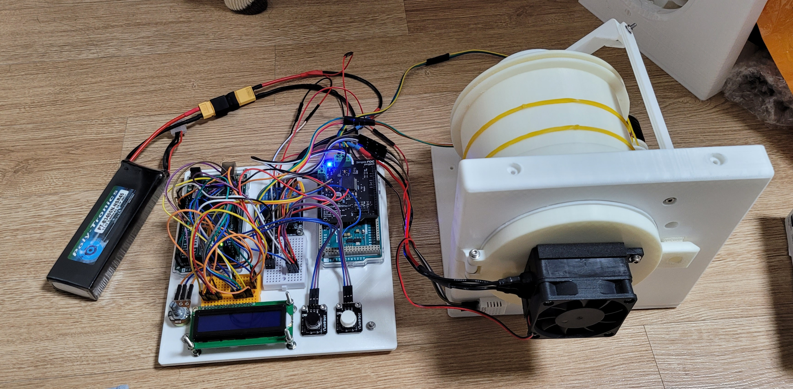

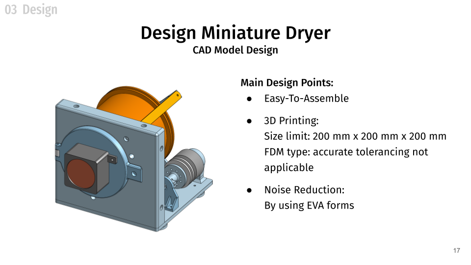
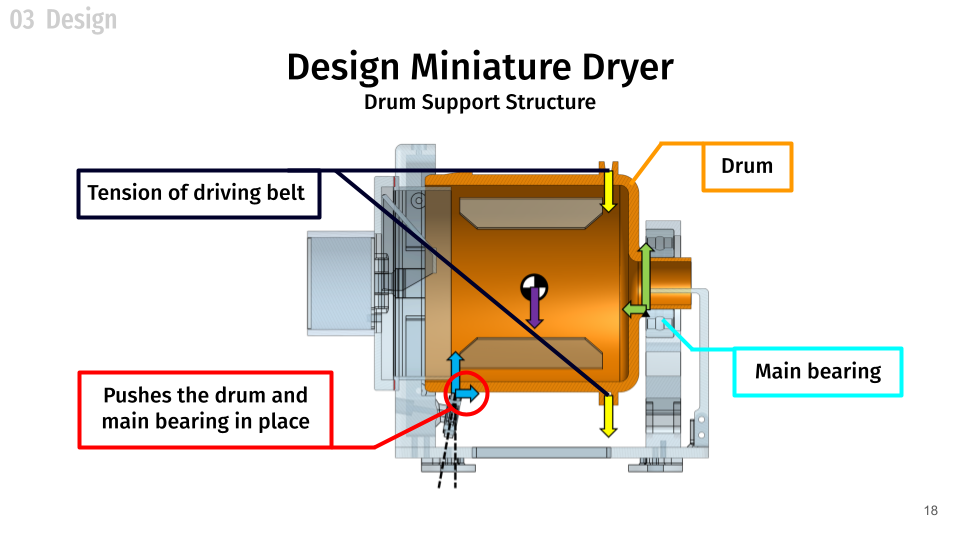
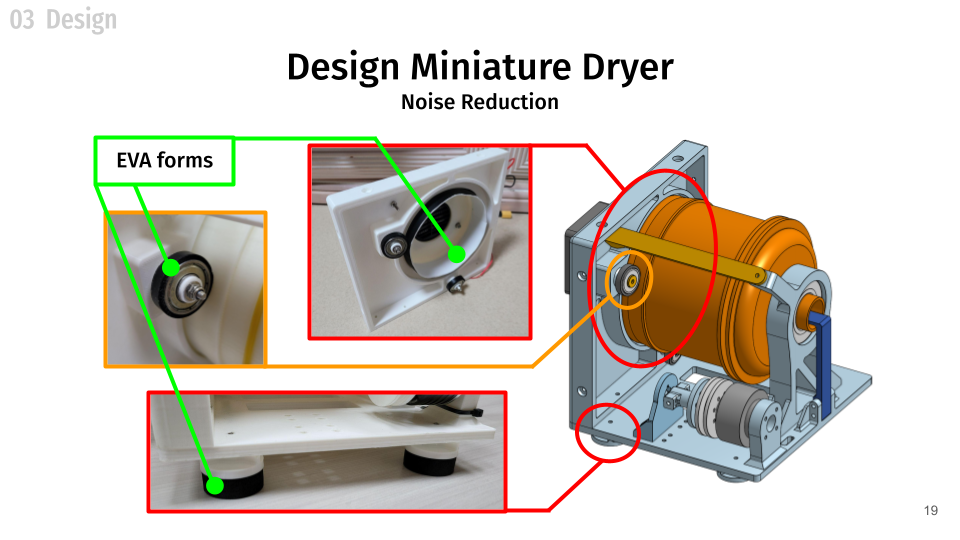
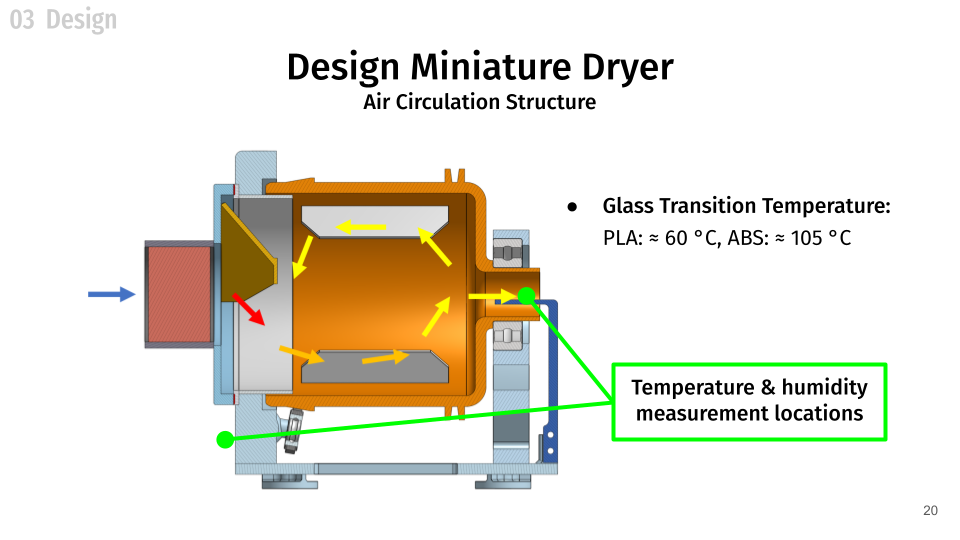

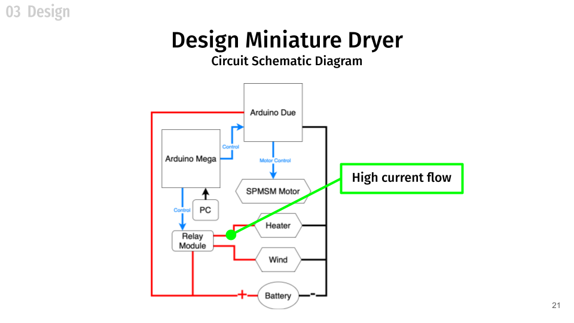
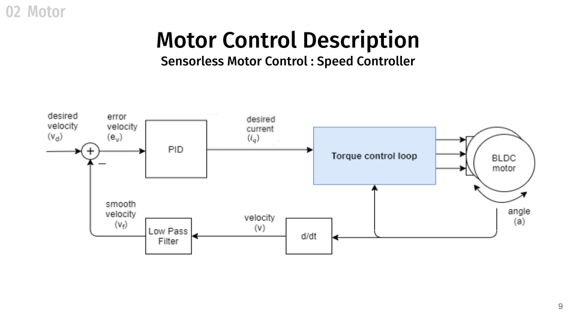
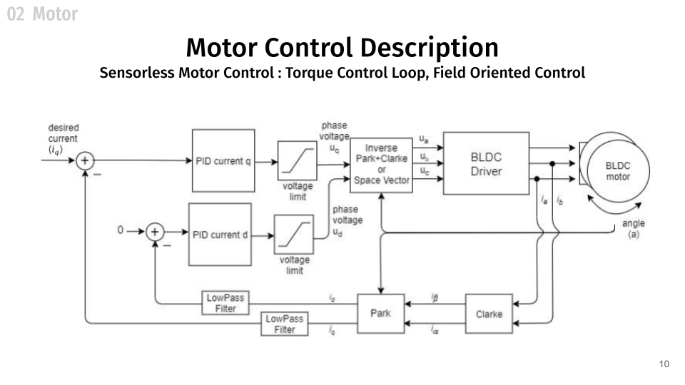
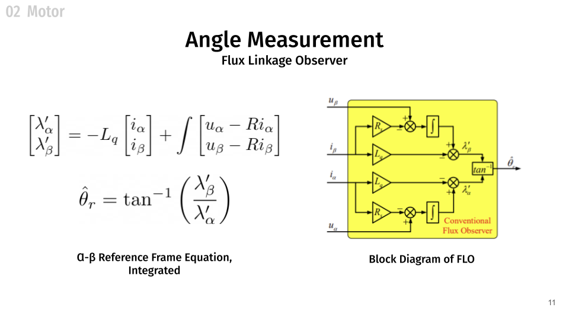

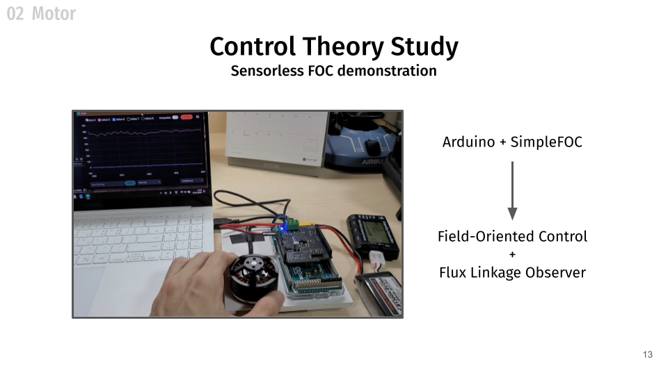
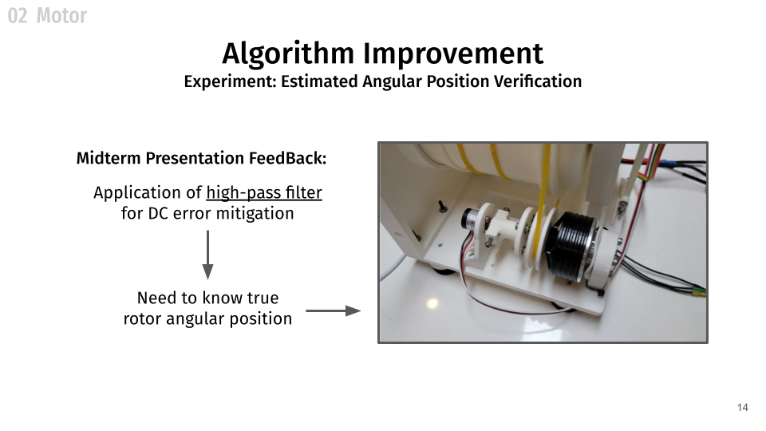
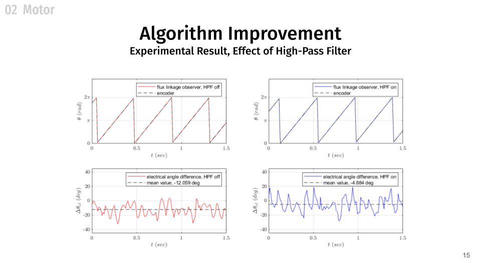
